# Windows 11 Installation in Oracle VirtualBox

## Overview

This is the first hands-on laboratory in a series of labs created to put into practice knowledge acquired during my preparation for the **CompTIA A+ certification**.

In this laboratory, I installed **Windows 11 Pro** on a virtual machine using **Oracle VirtualBox**. The lab covered virtual machine creation and configuration, Windows installation, disk partitioning, initial system configuration, and basic troubleshooting.

---

## Objective

The objectives of this laboratory were to:

- Download the Windows 11 ISO.
- Create and configure a virtual machine using Oracle VirtualBox.
- Install Windows 11 Pro.
- Configure virtual hardware resources.
- Partition the virtual hard disk.
- Complete the initial Windows 11 configuration.
- Troubleshoot a black-screen issue encountered during virtual machine startup.

---

## Lab Environment

| Component | Configuration |
|---|---|
| Virtualization Software | Oracle VirtualBox |
| Operating System | Windows 11 Pro |
| RAM | 4 GB |
| CPU | 2 cores |
| Virtual Hard Disk | 80 GB |
| Disk Layout | 50 GB + 30 GB |
| Installation Media | Windows 11 ISO |

---

## 1. Downloading the Windows 11 ISO

The first step was to access the Windows website and download the Windows 11 ISO.

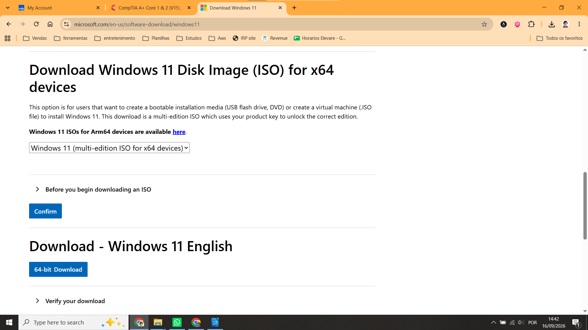

---

## 2. Creating and Configuring the Virtual Machine

After downloading the ISO, I created a virtual machine in Oracle VirtualBox.

The main configuration steps were:

1. Click **New**.
2. Set the machine name to `LabA-win11`.
3. Create the virtual machine.
4. Open **Settings**.
5. Configure **4 GB of RAM** and **2 CPU cores**.
6. Configure an **80 GB virtual hard disk**.
7. Mount the Windows 11 ISO in the **Optical Drive**.
8. Start the virtual machine using **Start with GUI**.

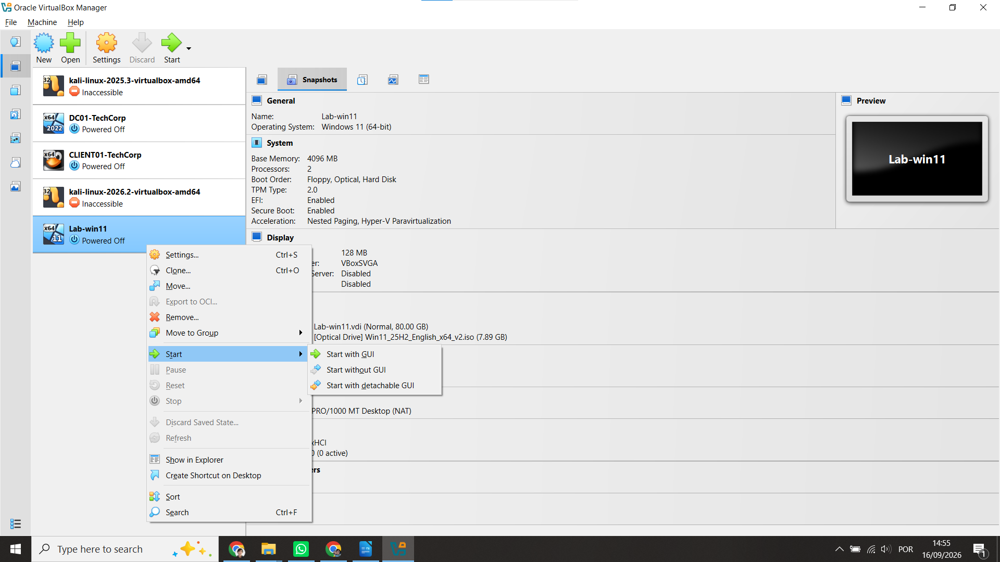

---

## 3. Troubleshooting: Black Screen

When the virtual machine was initially started, it displayed a black screen.

After checking the virtual machine settings, I changed the **Graphics Controller** under the **Display** section to:

`VMSVGA`

After this change, the problem was resolved and the Windows installation could continue.

This was the main troubleshooting issue encountered during the laboratory.

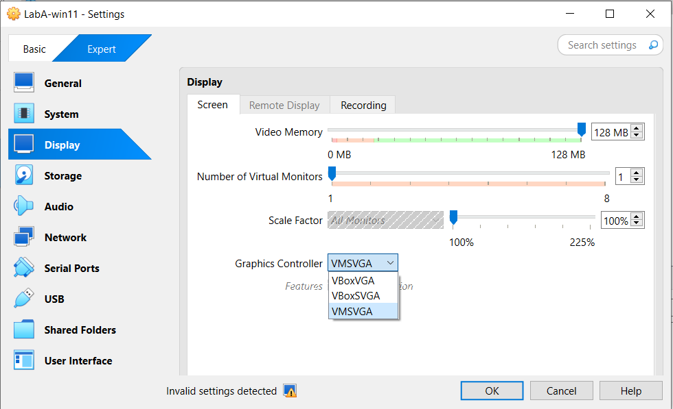

---

## 4. Starting Windows 11 Setup

After the virtual machine started correctly, it booted from the Windows 11 ISO.

The Windows Setup screen was displayed, allowing the installation process to begin.

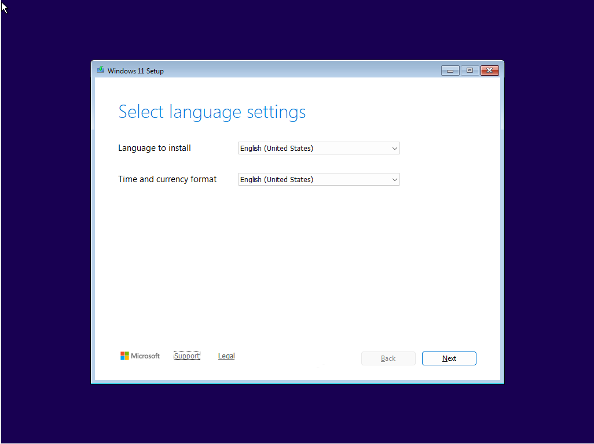

---

## 5. Selecting Windows 11 Pro

During setup, I proceeded through the installation options and selected:

> **I don't have a product key**

I then selected:

> **Windows 11 Pro**

Windows 11 Pro was selected because this virtual machine will be used for additional laboratories and testing.

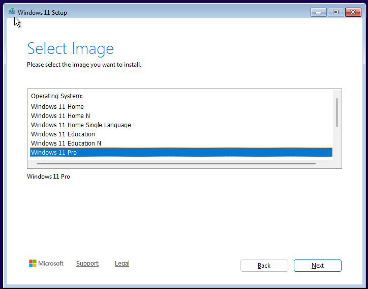

---

## 6. Disk Partitioning

The virtual hard disk was configured with **80 GB** of storage.

For training purposes, I divided the available space into two main partitions:

- **50 GB** for the Windows installation.
- **30 GB** reserved for future laboratory tests.

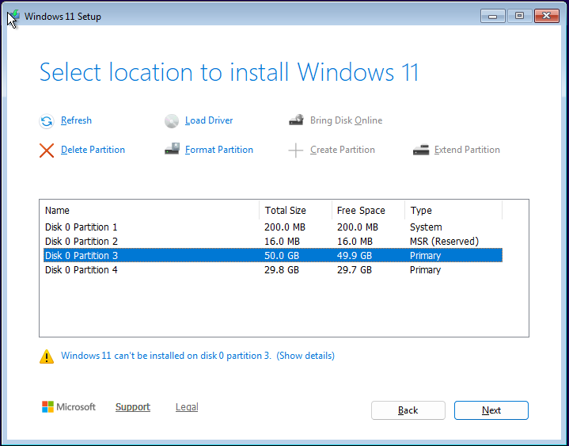

I selected the 50 GB partition as the Windows installation destination and continued with the setup.

---

## 7. Windows Installation

After reviewing the installation options, I started the Windows installation.

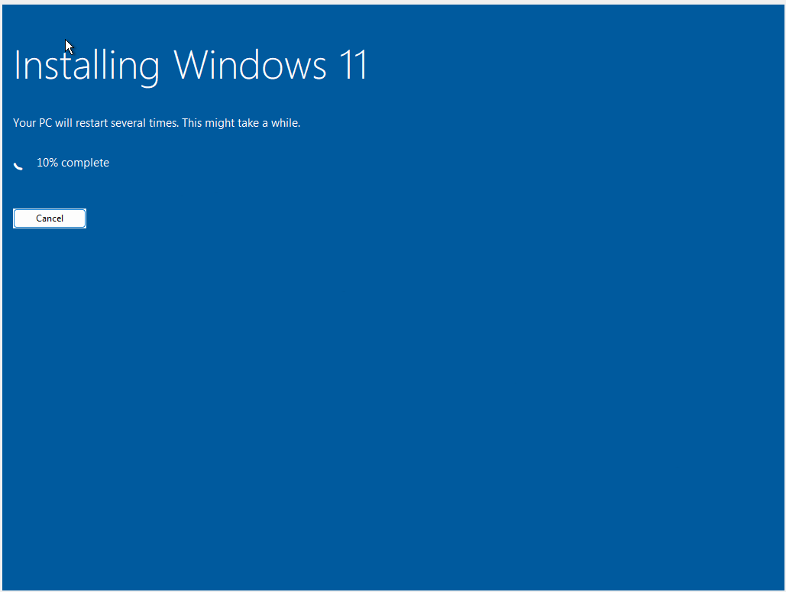

Windows then copied the required files and completed the installation process.

---

## 8. Region Configuration

After the installation and initial setup steps, Windows displayed the region configuration screen.

I selected:

> **Ireland**

and continued with the setup.

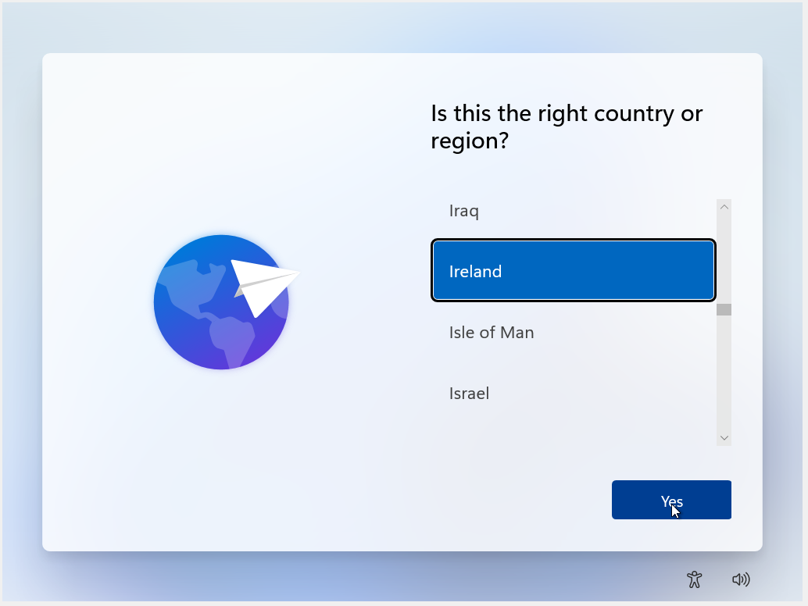

---

## 9. Windows Updates

The next steps included selecting the keyboard configuration and completing the initial Windows setup.

For the keyboard layout, I selected:

> **US**

When asked whether I wanted to add a second keyboard layout, I selected:

> **Skip**

During the initial Windows configuration, the system checked for updates and began the update process.

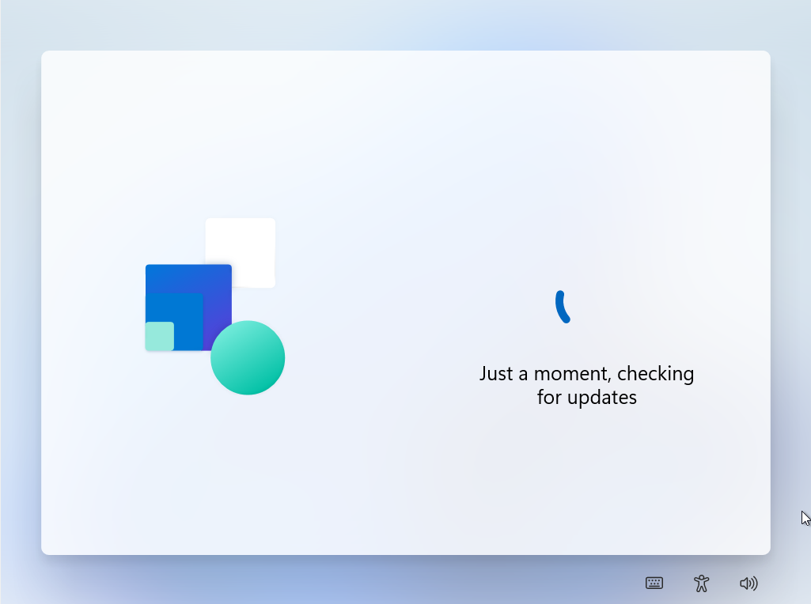


---

## 10. Initial Windows Configuration

After the update process was completed, Windows displayed the screen for adding a user.

The system then restarted.

After restarting, Windows performed the final configuration steps.

I then completed the remaining configuration using the minimum settings required for this laboratory.

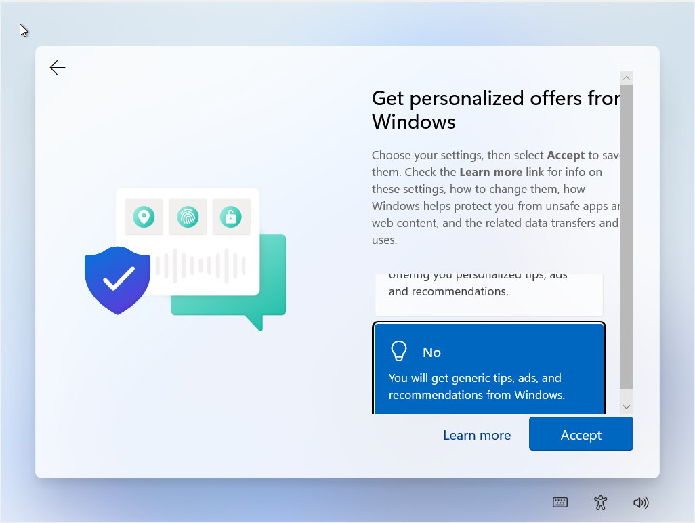

---

## 11. Installation Completed

After completing the initial configuration, the virtual machine restarted and the Windows 11 desktop was displayed.

This confirmed that the Windows 11 installation had been completed successfully.

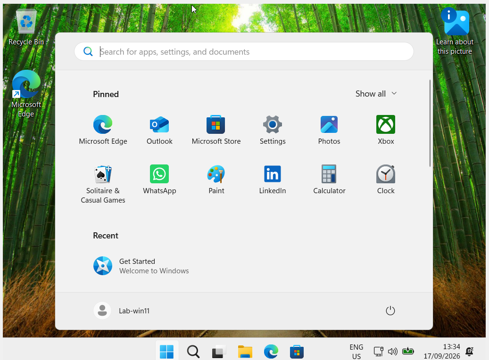

---

## Result

The Windows 11 installation was successfully completed in Oracle VirtualBox.

The final virtual machine configuration was:

- **Windows 11 Pro**
- **4 GB RAM**
- **2 CPU cores**
- **80 GB virtual hard disk**
- **50 GB partition for Windows**
- **30 GB reserved for future testing**

A black-screen issue occurred during the initial VM startup. The issue was resolved by changing the VirtualBox **Graphics Controller** to `VMSVGA`.

---

## Skills Practiced

- Oracle VirtualBox
- Virtual machine creation
- Virtual hardware configuration
- Windows 11 installation
- Disk partitioning
- Windows initial configuration
- Basic virtualization troubleshooting
- Technical documentation

---

## Conclusion

This laboratory provided hands-on practice with installing and configuring Windows 11 in a virtualized environment.

It also provided an opportunity to troubleshoot a real issue encountered during the lab and document the solution.

Future laboratories will focus on configuring and managing Windows features and troubleshooting different operating system problems.

---

## Repository Structure

```text
Windows-11-VirtualBox-Lab/
│
├── README.md
│
└── screenshots/
    ├── 01-windows-11-iso-download.png
    ├── 02-virtualbox-vm-configuration.png
    ├── 03-VM-troubleshooting.png
    ├── 04-windows-language-settings.png
    ├── 05-windows-11-pro-selection.png
    ├── 06-disk-partitioning.png
    ├── 07-windows-installation.png
    ├── 08-region-configuration.png
    ├── 09-checking-for-updates.png
    ├── 10-windows-initial-configuration.png
    └── 11-windows-11-desktop.png
```
